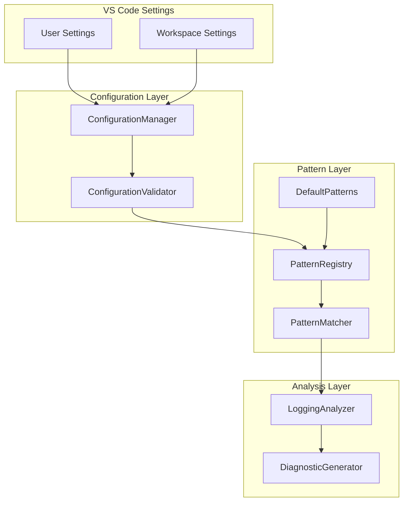

# Design Document: Configurable Sensitive Field Detection

## Overview

This design document describes the implementation of configurable sensitive field detection for the PII JSON Checker VS Code extension. The feature enables users to customize which field names are considered sensitive and which logging methods trigger masking warnings, while maintaining sensible defaults that work out-of-the-box.

The design prioritizes ease of use through:
- Zero-configuration startup with comprehensive defaults
- Intuitive setting names with clear descriptions
- Additive custom patterns (users don't need to re-specify defaults)
- Replace mode for logging methods (full control when needed)
- Real-time configuration updates without restart

## Architecture

The configuration system follows a layered architecture:



### Key Design Decisions

1. **Additive vs Replace Mode**: Custom sensitive field patterns are additive (merged with defaults) while logging methods use replace mode (user config overrides defaults). This matches user expectations: most users want to add a few custom fields but may want complete control over which logging methods are detected.

2. **Validation with Fallback**: Invalid configuration values fall back to defaults with user notification, ensuring the extension always works even with misconfiguration.

3. **Real-time Updates**: Configuration changes trigger immediate re-analysis of open documents via VS Code's `onDidChangeConfiguration` event.

4. **Normalized Pattern Matching**: All patterns are normalized (camelCase, snake_case, kebab-case → lowercase space-separated) for consistent matching regardless of naming convention.

## Components and Interfaces

### ConfigurationManager (Enhanced)

The existing `ConfigurationManager` will be enhanced to support the new configuration options.

```typescript
interface ConfigurationManager {
  // Existing methods (unchanged)
  getEffectivePatterns(): SensitivePattern[];
  getEnabledCategories(): PatternCategory[];
  getSeverity(): vscode.DiagnosticSeverity;
  isLoggingDetectionEnabled(): boolean;
  
  // Enhanced methods
  getExtraLoggingFunctions(): string[];  // Returns user-configured logging functions
  getExtraMaskingPatterns(): string[];   // Returns user-configured masking patterns
  
  // New methods
  getEffectiveLoggingMethods(): string[];  // Returns final list of logging methods to detect
  getExcludedPatterns(): string[];         // Returns patterns to exclude from detection
  
  // Validation
  validateConfiguration(): ValidationResult;
}

interface ValidationResult {
  isValid: boolean;
  warnings: ValidationWarning[];
}

interface ValidationWarning {
  setting: string;
  message: string;
  invalidValue: unknown;
  fallbackValue: unknown;
}
```

### ConfigurationValidator (New)

A new component to validate user configuration and provide helpful feedback.

```typescript
interface ConfigurationValidator {
  // Validate a single setting value
  validatePatternArray(patterns: unknown, settingName: string): ValidationResult;
  validateLoggingMethods(methods: unknown): ValidationResult;
  validateSeverity(severity: unknown): ValidationResult;
  
  // Validate entire configuration
  validateAll(): ValidationResult;
  
  // Normalize and clean configuration values
  normalizePatterns(patterns: string[]): string[];
  deduplicatePatterns(patterns: string[]): string[];
}
```

### PatternRegistry (New)

A new component to manage the merging of default and custom patterns.

```typescript
interface PatternRegistry {
  // Get merged patterns for a category (defaults + custom - excluded)
  getPatternsForCategory(category: PatternCategory): SensitivePattern[];
  
  // Get all effective patterns across enabled categories
  getAllEffectivePatterns(): SensitivePattern[];
  
  // Check if a pattern is excluded
  isExcluded(pattern: string): boolean;
  
  // Refresh patterns from configuration
  refresh(): void;
}
```

### LoggingMethodRegistry (New)

A new component to manage logging method detection configuration.

```typescript
interface LoggingMethodRegistry {
  // Get effective logging methods based on configuration
  getEffectiveMethods(languageId: string): string[];
  
  // Check if a method name should trigger detection
  isLoggingMethod(methodName: string, languageId: string): boolean;
  
  // Get default methods for a language
  getDefaultMethods(languageId: string): string[];
  
  // Refresh from configuration
  refresh(): void;
}
```

### Settings Schema Updates

The `package.json` contributes.configuration section will be updated with enhanced descriptions and examples:

```typescript
interface SettingsSchema {
  // Category toggles (existing, enhanced descriptions)
  "piiJsonChecker.categories.pii": boolean;
  "piiJsonChecker.categories.financial": boolean;
  "piiJsonChecker.categories.health": boolean;
  "piiJsonChecker.categories.credentials": boolean;
  
  // Custom patterns (existing, enhanced descriptions with examples)
  "piiJsonChecker.customPatterns.pii": string[];
  "piiJsonChecker.customPatterns.financial": string[];
  "piiJsonChecker.customPatterns.health": string[];
  "piiJsonChecker.customPatterns.credentials": string[];
  
  // Exclusions (existing, enhanced description)
  "piiJsonChecker.excludedPatterns": string[];
  
  // Logging configuration (existing, clarified behavior)
  "piiJsonChecker.loggingFunctions": string[];
  "piiJsonChecker.maskingPatterns": string[];
  
  // General settings (existing)
  "piiJsonChecker.severity": "Error" | "Warning" | "Information" | "Hint";
  "piiJsonChecker.enableLoggingDetection": boolean;
}
```

## Data Models

### Configuration State

```typescript
interface EffectiveConfiguration {
  // Enabled categories
  enabledCategories: Set<PatternCategory>;
  
  // Merged patterns (defaults + custom - excluded)
  patterns: SensitivePattern[];
  
  // Logging detection settings
  loggingMethods: {
    dotnet: string[];
    javascript: string[];
  };
  maskingPatterns: string[];
  
  // General settings
  severity: vscode.DiagnosticSeverity;
  loggingDetectionEnabled: boolean;
}
```

### Validation Models

```typescript
interface PatternValidation {
  original: string;
  normalized: string;
  isValid: boolean;
  reason?: string;  // If invalid, why
}

interface ConfigurationSnapshot {
  timestamp: Date;
  source: 'user' | 'workspace' | 'default';
  validationResult: ValidationResult;
  effectiveConfig: EffectiveConfiguration;
}
```

### Setting Metadata (for UI)

```typescript
interface SettingMetadata {
  key: string;
  displayName: string;
  description: string;
  tooltip: string;
  examples: string[];
  isAdditive: boolean;  // true = adds to defaults, false = replaces defaults
  isOptional: boolean;
  defaultValue: unknown;
}

// Example metadata for customPatterns.pii
const piiPatternsMetadata: SettingMetadata = {
  key: "piiJsonChecker.customPatterns.pii",
  displayName: "Additional PII Patterns",
  description: "Add custom field names to detect as Personal Identifiable Information",
  tooltip: "These patterns are added to the built-in PII patterns. Use this to detect organization-specific identifiers.",
  examples: ["employeeId", "staffNumber", "membershipId"],
  isAdditive: true,
  isOptional: true,
  defaultValue: []
};
```


## Correctness Properties

*A property is a characteristic or behavior that should hold true across all valid executions of a system—essentially, a formal statement about what the system should do. Properties serve as the bridge between human-readable specifications and machine-verifiable correctness guarantees.*

### Property Reflection

After analyzing the acceptance criteria, I identified the following redundancies and consolidations:

1. **Pattern Addition Properties (3.1, 3.2, 3.3, 5.2, 5.4, 8.2)**: These all test that custom patterns are added to defaults. Consolidated into a single "additive pattern merging" property.

2. **Pattern Exclusion Properties (5.3, 8.3)**: Both test exclusion functionality. Consolidated into one property.

3. **Validation Properties (7.2, 7.3, 7.4, 7.5)**: These test validation and fallback behavior. Consolidated into properties about validation and graceful degradation.

4. **Logging Method Configuration (4.1, 4.2, 4.3, 8.1)**: These test logging method configuration behavior. Consolidated into properties about replace mode and method detection.

5. **Format Normalization (3.4, 3.5)**: Both relate to pattern normalization. Consolidated into one round-trip normalization property.

### Property 1: Default Configuration Completeness

*For any* fresh configuration state (no user settings), the ConfigurationManager SHALL return:
- Non-empty patterns for all four categories (PII, Financial, Health, Credentials)
- All categories enabled
- Warning as the default severity
- Logging detection enabled

**Validates: Requirements 1.1, 1.2, 1.3, 1.5**

### Property 2: Additive Pattern Merging

*For any* custom pattern added to a category, the effective patterns SHALL include both the custom pattern AND all default patterns for that category (minus any excluded patterns).

**Validates: Requirements 3.1, 3.2, 3.3, 5.2, 5.4, 8.2**

### Property 3: Pattern Exclusion

*For any* pattern added to the exclusion list, that pattern SHALL NOT appear in the effective patterns, regardless of whether it was a default or custom pattern.

**Validates: Requirements 5.3, 8.3**

### Property 4: Pattern Deduplication

*For any* pattern that exists in both default patterns and custom patterns (after normalization), the effective patterns SHALL contain exactly one instance of that pattern.

**Validates: Requirements 3.4**

### Property 5: Pattern Normalization Round-Trip

*For any* identifier string, normalizing it and then matching against a pattern that normalizes to the same value SHALL succeed, regardless of the original naming convention (camelCase, snake_case, kebab-case, PascalCase).

**Validates: Requirements 3.5**

### Property 6: Logging Method Replace Mode

*For any* non-empty user-configured logging methods list, the effective logging methods SHALL contain ONLY the user-configured methods and NONE of the default methods.

**Validates: Requirements 4.1, 4.3, 8.1**

### Property 7: Logging Method Detection Scope

*For any* method call in analyzed code, a masking warning SHALL be generated if and only if:
1. The method name matches an effective logging method, AND
2. The arguments contain an unmasked sensitive field

**Validates: Requirements 4.2**

### Property 8: Logging Method Format Support

*For any* logging method configured in either fully qualified format (e.g., "Console.WriteLine") or short format (e.g., "Info"), the analyzer SHALL detect calls matching that format.

**Validates: Requirements 4.5**

### Property 9: Category Toggle Effect

*For any* category that is disabled via configuration, NO patterns from that category SHALL appear in the effective patterns, even if custom patterns were added to that category.

**Validates: Requirements 5.1**

### Property 10: Configuration Validation and Fallback

*For any* invalid configuration value (non-string in pattern array, empty string pattern, malformed entry), the ConfigurationManager SHALL:
1. Skip the invalid entry
2. Continue processing valid entries
3. Return a valid configuration state

**Validates: Requirements 7.2, 7.3, 7.4, 7.5**

### Property 11: Setting Key Naming Consistency

*For all* setting keys in the configuration schema, the keys SHALL follow the pattern `piiJsonChecker.<section>.<name>` where section and name use camelCase.

**Validates: Requirements 2.4**

## Error Handling

### Configuration Validation Errors

| Error Condition | Handling Strategy | User Feedback |
|----------------|-------------------|---------------|
| Non-array value for pattern setting | Fall back to empty array, merge with defaults | Warning notification with setting name |
| Non-string item in pattern array | Skip invalid item, keep valid items | Warning in output channel |
| Empty string pattern | Skip the empty pattern | Silent (common user mistake) |
| Whitespace-only pattern | Trim and skip if empty | Silent |
| Invalid severity value | Fall back to "Warning" | Warning notification |
| Non-boolean category toggle | Fall back to `true` (enabled) | Warning notification |

### Runtime Errors

| Error Condition | Handling Strategy | User Feedback |
|----------------|-------------------|---------------|
| Configuration read failure | Use cached configuration or defaults | Error notification |
| Pattern matching exception | Skip problematic pattern, continue analysis | Error logged to output channel |
| Document analysis failure | Clear diagnostics for document | Error logged to output channel |

### Validation Implementation

```typescript
function validatePatternArray(value: unknown, settingName: string): string[] {
  if (!Array.isArray(value)) {
    logWarning(`Invalid value for ${settingName}: expected array, got ${typeof value}`);
    return [];
  }
  
  return value
    .filter((item): item is string => {
      if (typeof item !== 'string') {
        logWarning(`Invalid item in ${settingName}: expected string, got ${typeof item}`);
        return false;
      }
      return true;
    })
    .map(s => s.trim())
    .filter(s => s.length > 0);
}
```

## Testing Strategy

### Dual Testing Approach

This feature requires both unit tests and property-based tests:

- **Unit tests**: Verify specific examples, edge cases, and error conditions
- **Property tests**: Verify universal properties across all valid inputs

### Property-Based Testing Configuration

- **Library**: fast-check (TypeScript property-based testing library)
- **Iterations**: Minimum 100 iterations per property test
- **Tag format**: `Feature: configurable-sensitive-field-detection, Property {number}: {property_text}`

### Test Categories

#### 1. Configuration Validation Tests (Unit + Property)

**Unit Tests:**
- Empty configuration returns defaults
- Invalid severity falls back to Warning
- Empty pattern array is valid (uses defaults only)

**Property Tests:**
- Property 1: Default configuration completeness
- Property 10: Configuration validation and fallback

#### 2. Pattern Merging Tests (Property)

**Property Tests:**
- Property 2: Additive pattern merging
- Property 3: Pattern exclusion
- Property 4: Pattern deduplication

**Generators:**
- `arbitraryPatternCategory`: Generates random PatternCategory
- `arbitraryPattern`: Generates valid pattern strings (alphanumeric, various cases)
- `arbitraryPatternList`: Generates lists of 0-20 patterns

#### 3. Pattern Matching Tests (Property)

**Property Tests:**
- Property 5: Pattern normalization round-trip

**Generators:**
- `arbitraryIdentifier`: Generates identifiers in various naming conventions
- `arbitraryNamingConvention`: Generates camelCase, snake_case, kebab-case, PascalCase

#### 4. Logging Method Tests (Unit + Property)

**Unit Tests:**
- Empty logging methods list disables detection (Requirement 4.4)
- Default methods exist for .NET and JavaScript

**Property Tests:**
- Property 6: Logging method replace mode
- Property 7: Logging method detection scope
- Property 8: Logging method format support

**Generators:**
- `arbitraryMethodName`: Generates valid method names
- `arbitraryQualifiedMethodName`: Generates "Class.method" format names

#### 5. Category Toggle Tests (Property)

**Property Tests:**
- Property 9: Category toggle effect

**Generators:**
- `arbitraryCategorySet`: Generates subsets of categories to enable/disable

### Example Property Test Implementation

```typescript
import * as fc from 'fast-check';
import { ConfigurationManager } from '../config/configurationManager';
import { PatternCategory } from '../patterns/types';

describe('Configurable Sensitive Field Detection', () => {
  // Feature: configurable-sensitive-field-detection, Property 2: Additive pattern merging
  it('should merge custom patterns with defaults additively', () => {
    fc.assert(
      fc.property(
        fc.array(fc.string().filter(s => s.trim().length > 0), { minLength: 1, maxLength: 10 }),
        fc.constantFrom(...Object.values(PatternCategory)),
        (customPatterns, category) => {
          // Setup: Configure custom patterns for category
          const config = createMockConfig({
            [`customPatterns.${category}`]: customPatterns
          });
          
          const manager = new ConfigurationManager(config);
          const effective = manager.getEffectivePatterns();
          
          // Assert: All custom patterns are present
          const effectiveForCategory = effective.filter(p => p.category === category);
          const effectivePatternStrings = effectiveForCategory.map(p => p.pattern);
          
          for (const custom of customPatterns) {
            expect(effectivePatternStrings).toContain(custom);
          }
          
          // Assert: Default patterns are also present (unless excluded)
          const defaults = DEFAULT_PATTERNS[category];
          for (const defaultPattern of defaults) {
            expect(effectivePatternStrings).toContain(defaultPattern);
          }
        }
      ),
      { numRuns: 100 }
    );
  });

  // Feature: configurable-sensitive-field-detection, Property 5: Pattern normalization round-trip
  it('should match patterns regardless of naming convention', () => {
    fc.assert(
      fc.property(
        fc.array(fc.letterString(), { minLength: 2, maxLength: 4 }),
        (words) => {
          const camelCase = words[0].toLowerCase() + words.slice(1).map(w => w.charAt(0).toUpperCase() + w.slice(1).toLowerCase()).join('');
          const snakeCase = words.map(w => w.toLowerCase()).join('_');
          const kebabCase = words.map(w => w.toLowerCase()).join('-');
          
          const matcher = new PatternMatcher();
          const pattern: SensitivePattern = {
            pattern: camelCase,
            category: PatternCategory.PII,
            compliance: ['GDPR']
          };
          
          // All naming conventions should match the same pattern
          expect(matcher.matches(camelCase, [pattern])).not.toBeNull();
          expect(matcher.matches(snakeCase, [pattern])).not.toBeNull();
          expect(matcher.matches(kebabCase, [pattern])).not.toBeNull();
        }
      ),
      { numRuns: 100 }
    );
  });
});
```

### Test File Organization

```
extension/
├── src/
│   └── ...
└── test/
    ├── unit/
    │   ├── configurationManager.test.ts
    │   ├── patternMatcher.test.ts
    │   └── loggingAnalyzer.test.ts
    └── property/
        ├── generators/
        │   ├── patternGenerators.ts
        │   └── configGenerators.ts
        ├── configurationProperties.test.ts
        ├── patternMergingProperties.test.ts
        ├── patternMatchingProperties.test.ts
        └── loggingMethodProperties.test.ts
```
