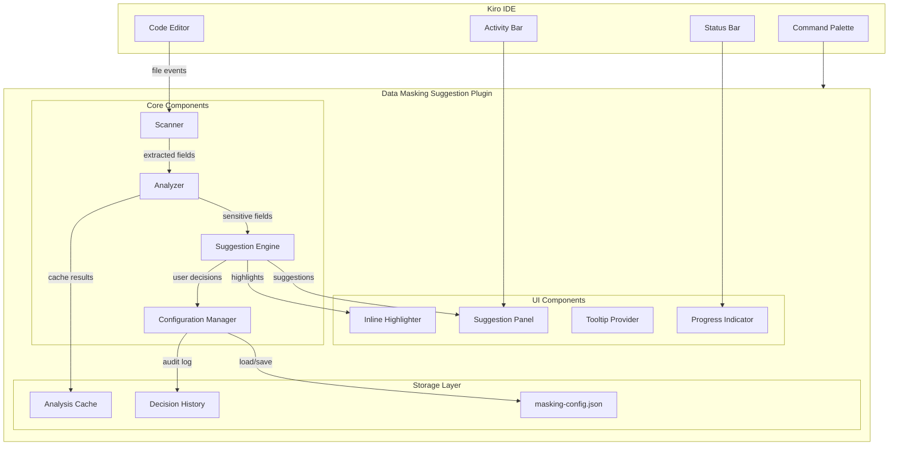
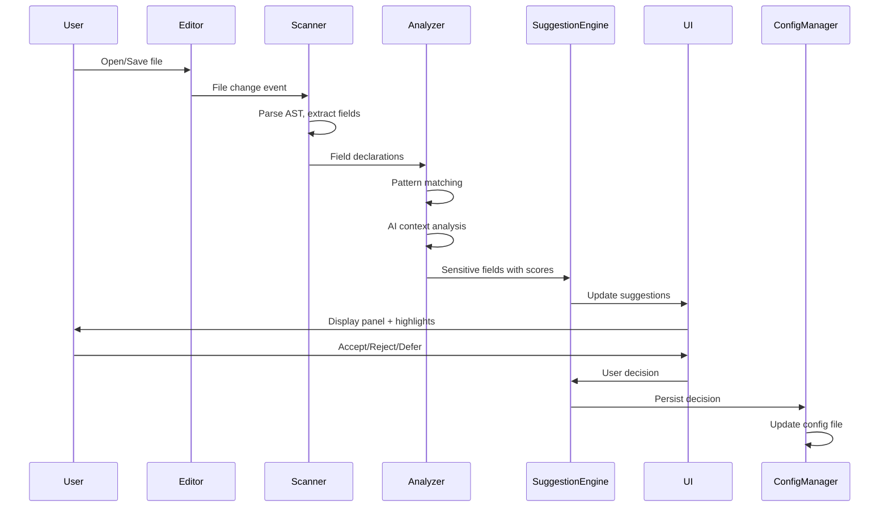

# Design Document: Data Masking Suggestion Plugin

## Overview

The Data Masking Suggestion Plugin is a Kiro IDE extension that provides AI-powered detection and masking suggestions for sensitive data fields in source code. The plugin scans code files, analyzes context using pattern matching and AI inference, and presents actionable suggestions to developers through an integrated UI panel and inline code highlighting.

The system follows a modular architecture with four core components:
1. **Scanner** - Parses source files and extracts field/variable declarations
2. **Analyzer** - Applies pattern detection and AI context analysis to identify sensitive fields
3. **Suggestion Engine** - Manages suggestion lifecycle and user interactions
4. **Configuration Manager** - Handles persistence of masking rules and user decisions

## Architecture



### Data Flow



## Components and Interfaces

### Scanner Component

The Scanner is responsible for parsing source files and extracting field declarations across supported languages.

```typescript
interface IScanner {
  /**
   * Scans a single file and extracts field declarations
   * @param filePath - Path to the file to scan
   * @returns Promise resolving to extracted fields
   */
  scanFile(filePath: string): Promise<ScanResult>;

  /**
   * Scans all files in the workspace
   * @param options - Scan configuration options
   * @returns AsyncIterator for streaming results
   */
  scanWorkspace(options: ScanOptions): AsyncIterableIterator<ScanResult>;

  /**
   * Checks if a file type is supported for scanning
   * @param filePath - Path to check
   */
  isSupported(filePath: string): boolean;
}

interface ScanResult {
  filePath: string;
  fields: FieldDeclaration[];
  errors: ScanError[];
  duration: number;
}

interface FieldDeclaration {
  name: string;
  type: string | null;
  location: CodeLocation;
  context: FieldContext;
}

interface FieldContext {
  surroundingCode: string;
  comments: string[];
  parentScope: string;
  usageContexts: UsageContext[];
}

interface ScanOptions {
  includePatterns: string[];
  excludePatterns: string[];
  maxFileSizeBytes: number;
  onDemand: boolean;
}
```

### Analyzer Component

The Analyzer applies pattern detection and AI-powered context analysis to identify sensitive fields.

```typescript
interface IAnalyzer {
  /**
   * Analyzes fields for sensitivity
   * @param fields - Fields to analyze
   * @returns Analyzed fields with confidence scores
   */
  analyze(fields: FieldDeclaration[]): Promise<AnalysisResult[]>;

  /**
   * Registers a custom masking pattern
   * @param pattern - Custom pattern definition
   */
  registerPattern(pattern: MaskingPattern): void;

  /**
   * Records user feedback to improve detection
   * @param feedback - User feedback on a suggestion
   */
  recordFeedback(feedback: UserFeedback): void;
}

interface AnalysisResult {
  field: FieldDeclaration;
  isSensitive: boolean;
  confidenceScore: number;
  detectedPatterns: MaskingPatternType[];
  reasoning: string;
  priority: Priority;
}

interface MaskingPattern {
  id: string;
  name: string;
  type: MaskingPatternType;
  fieldNamePatterns: RegExp[];
  valuePatterns: RegExp[];
  contextIndicators: string[];
}

type MaskingPatternType = 
  | 'pii'
  | 'credentials'
  | 'financial'
  | 'health'
  | 'custom';

type Priority = 'high' | 'medium' | 'low';
```

### Suggestion Engine Component

The Suggestion Engine manages the lifecycle of suggestions and handles user interactions.

```typescript
interface ISuggestionEngine {
  /**
   * Gets all current suggestions
   */
  getSuggestions(): Suggestion[];

  /**
   * Gets suggestions filtered by criteria
   */
  getSuggestions(filter: SuggestionFilter): Suggestion[];

  /**
   * Processes a user decision on a suggestion
   */
  processDecision(suggestionId: string, decision: UserDecision): Promise<void>;

  /**
   * Applies a decision to similar fields across workspace
   */
  applyToSimilar(suggestionId: string, decision: UserDecision): Promise<number>;

  /**
   * Adds a custom field to the masking list
   */
  addCustomField(field: CustomFieldInput): Promise<Suggestion>;
}

interface Suggestion {
  id: string;
  field: FieldDeclaration;
  confidenceScore: number;
  patternType: MaskingPatternType;
  status: SuggestionStatus;
  recommendedAction: MaskingAction;
  createdAt: Date;
  reviewedAt: Date | null;
}

type SuggestionStatus = 'pending' | 'accepted' | 'rejected' | 'deferred';

interface SuggestionFilter {
  patternTypes?: MaskingPatternType[];
  minConfidence?: number;
  status?: SuggestionStatus[];
  filePath?: string;
}

interface UserDecision {
  action: 'accept' | 'reject' | 'defer';
  applyToSimilar?: boolean;
  notes?: string;
}
```

### Configuration Manager Component

The Configuration Manager handles persistence of masking configurations and user decisions.

```typescript
interface IConfigurationManager {
  /**
   * Loads configuration from disk
   */
  load(): Promise<MaskingConfiguration>;

  /**
   * Saves current configuration to disk
   */
  save(config: MaskingConfiguration): Promise<void>;

  /**
   * Exports configuration to specified format
   */
  export(format: ExportFormat): Promise<string>;

  /**
   * Imports configuration from file
   */
  import(filePath: string): Promise<MaskingConfiguration>;

  /**
   * Gets decision history for audit
   */
  getDecisionHistory(filter?: HistoryFilter): DecisionRecord[];
}

interface MaskingConfiguration {
  version: string;
  maskedFields: MaskedFieldEntry[];
  rejectedFields: RejectedFieldEntry[];
  customPatterns: MaskingPattern[];
  settings: PluginSettings;
}

interface MaskedFieldEntry {
  fieldName: string;
  filePath: string;
  patternType: MaskingPatternType;
  addedAt: Date;
  addedBy: string;
}

interface DecisionRecord {
  suggestionId: string;
  fieldName: string;
  filePath: string;
  decision: UserDecision;
  timestamp: Date;
  userId: string;
}

type ExportFormat = 'json' | 'csv' | 'markdown';
```

### Report Generator Component

```typescript
interface IReportGenerator {
  /**
   * Generates a summary report of all findings
   */
  generateReport(options: ReportOptions): Promise<Report>;

  /**
   * Exports report to specified format
   */
  exportReport(report: Report, format: ExportFormat): string;

  /**
   * Copies suggestion list to clipboard
   */
  copyToClipboard(suggestions: Suggestion[]): Promise<void>;
}

interface ReportOptions {
  includePatterns?: MaskingPatternType[];
  minConfidence?: number;
  includeStatus?: SuggestionStatus[];
}

interface Report {
  generatedAt: Date;
  workspacePath: string;
  totalFiles: number;
  totalSuggestions: number;
  findings: ReportFinding[];
  summary: ReportSummary;
}

interface ReportFinding {
  fieldName: string;
  filePath: string;
  lineNumber: number;
  patternType: MaskingPatternType;
  confidenceScore: number;
  status: SuggestionStatus;
}
```

## Data Models

### Core Entities

```typescript
// Code location within a file
interface CodeLocation {
  filePath: string;
  startLine: number;
  startColumn: number;
  endLine: number;
  endColumn: number;
}

// Usage context for a field
interface UsageContext {
  type: 'logging' | 'serialization' | 'api_response' | 'storage' | 'display' | 'other';
  location: CodeLocation;
  risk: 'high' | 'medium' | 'low';
}

// Plugin settings
interface PluginSettings {
  scanOnSave: boolean;
  scanOnOpen: boolean;
  maxCpuPercent: number;
  scanFrequencyMs: number;
  cacheEnabled: boolean;
  cacheTtlMs: number;
  onDemandThreshold: number;
  keyboardShortcuts: KeyboardShortcuts;
}

interface KeyboardShortcuts {
  acceptSuggestion: string;
  rejectSuggestion: string;
  deferSuggestion: string;
  openPanel: string;
}

// Scan error information
interface ScanError {
  filePath: string;
  message: string;
  line?: number;
  recoverable: boolean;
}

// User feedback for ML improvement
interface UserFeedback {
  fieldName: string;
  expectedSensitive: boolean;
  actualSensitive: boolean;
  patternType: MaskingPatternType | null;
  context: string;
}
```

### Configuration File Schema

The masking configuration is stored in `.kiro/masking-config.json`:

```json
{
  "version": "1.0.0",
  "maskedFields": [
    {
      "fieldName": "userEmail",
      "filePath": "src/models/user.ts",
      "patternType": "pii",
      "addedAt": "2024-01-15T10:30:00Z",
      "addedBy": "developer@example.com"
    }
  ],
  "rejectedFields": [
    {
      "fieldName": "emailTemplate",
      "filePath": "src/templates/email.ts",
      "reason": "Template variable, not actual email",
      "rejectedAt": "2024-01-15T11:00:00Z"
    }
  ],
  "customPatterns": [
    {
      "id": "custom-employee-id",
      "name": "Employee ID",
      "type": "custom",
      "fieldNamePatterns": ["employeeId", "empId", "staffNumber"],
      "valuePatterns": ["^EMP-\\d{6}$"],
      "contextIndicators": ["employee", "staff", "hr"]
    }
  ],
  "settings": {
    "scanOnSave": true,
    "scanOnOpen": true,
    "maxCpuPercent": 25,
    "scanFrequencyMs": 1000,
    "cacheEnabled": true,
    "cacheTtlMs": 300000,
    "onDemandThreshold": 1000
  }
}
```

### Analysis Cache Schema

```typescript
interface CacheEntry {
  filePath: string;
  fileHash: string;
  analysisResults: AnalysisResult[];
  cachedAt: number;
  expiresAt: number;
}

interface AnalysisCache {
  entries: Map<string, CacheEntry>;
  maxSize: number;
  evictionPolicy: 'lru' | 'ttl';
}
```


## Correctness Properties

*A property is a characteristic or behavior that should hold true across all valid executions of a system—essentially, a formal statement about what the system should do. Properties serve as the bridge between human-readable specifications and machine-verifiable correctness guarantees.*

### Property 1: Field Extraction Completeness

*For any* valid source file in a supported language (JavaScript, TypeScript, Python, C#, Java, JSON), the Scanner should extract all field names, variable declarations, and property definitions present in the file.

**Validates: Requirements 1.1, 1.3**

### Property 2: Scan Resilience

*For any* set of files where some contain syntax errors and others are valid, the Scanner should successfully parse all valid files and log errors for invalid files without terminating the scan.

**Validates: Requirements 1.4**

### Property 3: Sensitive Pattern Detection

*For any* field with a name matching a known sensitive pattern (PII, credentials, financial, or health), the Analyzer should detect it as sensitive and assign the correct pattern type category.

**Validates: Requirements 2.1, 2.2, 2.3, 2.4**

### Property 4: Confidence Score Assignment

*For any* field detected as sensitive by the Analyzer, the analysis result must include a confidence score between 0 and 100.

**Validates: Requirements 2.6**

### Property 5: High-Risk Context Priority

*For any* field used in logging, serialization, or API response contexts, the Analyzer should assign a higher priority than fields not used in these contexts.

**Validates: Requirements 3.3**

### Property 6: Suggestion Completeness

*For any* suggestion returned by the Suggestion Engine, it must contain the field name, file location, confidence score, and recommended masking action.

**Validates: Requirements 4.2**

### Property 7: Suggestion Sorting

*For any* list of suggestions sorted by confidence score, file location, or pattern category, the resulting list should be correctly ordered according to the specified sort criteria.

**Validates: Requirements 4.5**

### Property 8: Accept Decision Persistence

*For any* suggestion that is accepted by the user, the corresponding field should be added to the masking configuration file and should not appear as a new suggestion in subsequent scans.

**Validates: Requirements 5.1**

### Property 9: Reject Decision Exclusion

*For any* suggestion that is rejected by the user, the corresponding field should be excluded from future suggestions for that specific field in that file.

**Validates: Requirements 5.2**

### Property 10: Defer Decision Visibility

*For any* suggestion that is deferred by the user, the suggestion should remain visible in the panel with a "pending" status.

**Validates: Requirements 5.3**

### Property 11: Similar Field Application

*For any* accepted suggestion where "apply to similar" is selected, all fields with matching names across the workspace should receive the same decision.

**Validates: Requirements 5.5**

### Property 12: Decision History Completeness

*For any* user decision (accept, reject, or defer), a corresponding record should be added to the decision history with timestamp and user information.

**Validates: Requirements 5.6**

### Property 13: Configuration Round-Trip

*For any* valid masking configuration, exporting and then importing the configuration should produce an equivalent configuration.

**Validates: Requirements 6.2**

### Property 14: Configuration Load on Startup

*For any* workspace with an existing masking configuration file, loading the configuration should restore all previously saved masked fields, rejected fields, and custom patterns.

**Validates: Requirements 6.3**

### Property 15: Custom Pattern Detection

*For any* custom masking pattern defined by the user with regex rules, fields matching those patterns should be detected as sensitive with the custom pattern type.

**Validates: Requirements 6.4**

### Property 16: Corrupted Configuration Recovery

*For any* corrupted masking configuration file, the Plugin should create a backup of the corrupted file and initialize a new valid configuration.

**Validates: Requirements 6.5**

### Property 17: Configuration Inheritance

*For any* setting defined at both workspace and user levels, the user-level setting should override the workspace-level setting.

**Validates: Requirements 6.6**

### Property 18: File Save Triggers Rescan

*For any* file save event, the modified file should be re-scanned and suggestions should be updated to reflect any changes.

**Validates: Requirements 7.4**

### Property 19: Scan Performance

*For any* source file under 1000 lines, the Scanner should complete parsing within 500 milliseconds.

**Validates: Requirements 8.1**

### Property 20: Incremental Scanning

*For any* file that has not changed since the last scan, the Plugin should use cached analysis results instead of re-analyzing the file.

**Validates: Requirements 8.2**

### Property 21: On-Demand Scanning for Large Workspaces

*For any* workspace containing more than 1000 files, the Plugin should scan files on-demand (when opened or saved) rather than scanning all files at once.

**Validates: Requirements 8.5**

### Property 22: Report Completeness

*For any* generated report, it should include all detected sensitive fields in the workspace with field name, file location, pattern type, confidence score, and decision status.

**Validates: Requirements 9.1, 9.3**

### Property 23: Report Format Validity

*For any* report exported in JSON, CSV, or Markdown format, the output should be valid and parseable in that format.

**Validates: Requirements 9.2**

### Property 24: Report Filtering

*For any* report filter applied (by pattern category, confidence threshold, or decision status), the resulting report should contain only findings that match the filter criteria.

**Validates: Requirements 9.4**

## Error Handling

### Scanner Errors

| Error Type | Handling Strategy | User Feedback |
|------------|-------------------|---------------|
| Syntax Error | Log error, skip file, continue scanning | Warning in output panel |
| File Not Found | Log error, remove from scan queue | None (silent) |
| Permission Denied | Log error, skip file | Warning in output panel |
| File Too Large | Skip file, log warning | Info message |
| Unsupported Language | Skip file silently | None |

### Analyzer Errors

| Error Type | Handling Strategy | User Feedback |
|------------|-------------------|---------------|
| Pattern Regex Invalid | Disable pattern, log error | Error notification |
| AI Service Unavailable | Fall back to pattern-only detection | Info message |
| Timeout | Return partial results | Warning in panel |

### Configuration Errors

| Error Type | Handling Strategy | User Feedback |
|------------|-------------------|---------------|
| Config File Corrupted | Backup and reinitialize | Warning notification |
| Invalid JSON | Backup and reinitialize | Error notification |
| Schema Validation Failed | Migrate or reinitialize | Info message |
| Permission Denied | Use in-memory config | Warning notification |

### Error Response Codes

```typescript
enum PluginErrorCode {
  // Scanner errors (1xxx)
  SCAN_SYNTAX_ERROR = 1001,
  SCAN_FILE_NOT_FOUND = 1002,
  SCAN_PERMISSION_DENIED = 1003,
  SCAN_FILE_TOO_LARGE = 1004,
  
  // Analyzer errors (2xxx)
  ANALYZE_PATTERN_INVALID = 2001,
  ANALYZE_SERVICE_UNAVAILABLE = 2002,
  ANALYZE_TIMEOUT = 2003,
  
  // Configuration errors (3xxx)
  CONFIG_CORRUPTED = 3001,
  CONFIG_INVALID_JSON = 3002,
  CONFIG_SCHEMA_INVALID = 3003,
  CONFIG_PERMISSION_DENIED = 3004,
  
  // Report errors (4xxx)
  REPORT_GENERATION_FAILED = 4001,
  REPORT_EXPORT_FAILED = 4002,
}

interface PluginError {
  code: PluginErrorCode;
  message: string;
  details?: Record<string, unknown>;
  recoverable: boolean;
}
```

## Testing Strategy

### Unit Testing

Unit tests focus on specific examples, edge cases, and error conditions:

- **Scanner Tests**: Test parsing of specific code patterns in each supported language
- **Pattern Matching Tests**: Test detection of specific sensitive field names and values
- **Configuration Tests**: Test loading, saving, and merging of configuration files
- **Report Generation Tests**: Test output format correctness for each export type

### Property-Based Testing

Property-based tests verify universal properties across randomly generated inputs. The plugin will use **fast-check** as the property-based testing library for TypeScript.

**Configuration**:
- Minimum 100 iterations per property test
- Each test tagged with: `Feature: data-masking-suggestion-plugin, Property {number}: {property_text}`

**Key Property Tests**:

1. **Field Extraction Property**: Generate random valid source files, verify all declared fields are extracted
2. **Pattern Detection Property**: Generate field names matching sensitive patterns, verify correct detection
3. **Confidence Score Invariant**: Verify all analysis results have valid confidence scores (0-100)
4. **Sorting Property**: Generate random suggestions, verify sorting produces correctly ordered results
5. **Round-Trip Property**: Generate configurations, export/import, verify equivalence
6. **Filter Property**: Generate suggestions with various attributes, verify filters return correct subsets

### Integration Testing

- **IDE Integration**: Test plugin activation, command registration, and event handling
- **File System Integration**: Test configuration file creation, backup, and recovery
- **End-to-End Workflows**: Test complete user workflows from scan to decision to report

### Performance Testing

- **Scan Performance**: Verify files under 1000 lines scan within 500ms
- **Cache Effectiveness**: Verify cached results are used for unchanged files
- **Large Workspace Handling**: Verify on-demand scanning activates for 1000+ file workspaces
