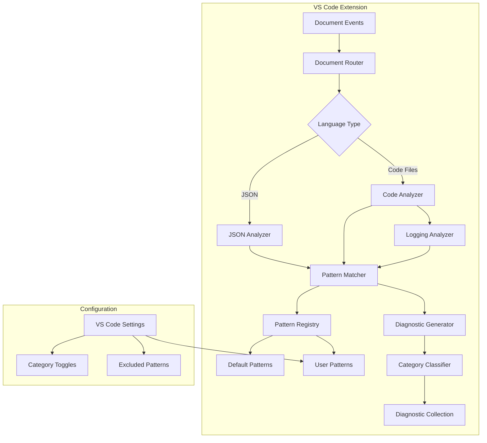

# Design Document: Enhanced Sensitive Field Detection

## Overview

This design document describes the architecture and implementation approach for enhancing the PII Checker VS Code extension to detect a comprehensive set of sensitive data fields. The current implementation only detects `firstName` and `lastName` patterns. This enhancement will expand detection to cover:

- Personal Identifiable Information (PII) - names, contacts, identifiers, addresses, dates
- Financial Data (PCI-DSS) - credit cards, bank accounts, payment info
- Health Information (HIPAA) - patient identifiers, medical data, insurance, providers
- Authentication Credentials - passwords, tokens, API keys, connection strings

The extension will maintain backward compatibility while introducing a categorized pattern system with configurable detection and compliance-aware diagnostic messages.

## Architecture



### Key Architectural Decisions

1. **Categorized Pattern Registry**: Patterns are organized by category (PII, Financial, Health, Credentials) rather than a flat list. This enables category-level configuration and compliance-specific messaging.

2. **Normalized Matching**: All pattern matching uses a normalization function that handles camelCase, snake_case, kebab-case, and space-separated formats uniformly.

3. **Layered Detection**: The detection pipeline separates pattern matching from context analysis (logging detection), allowing each to evolve independently.

4. **Configuration Merging**: User-defined patterns merge with defaults rather than replacing them, unless explicitly excluded.

## Components and Interfaces

### PatternRegistry

Manages the categorized collection of sensitive field patterns.

```typescript
interface SensitivePattern {
  pattern: string;           // The pattern to match (e.g., "firstName")
  category: PatternCategory; // PII, Financial, Health, Credentials
  compliance: string[];      // Relevant regulations (GDPR, PCI-DSS, HIPAA)
}

enum PatternCategory {
  PII = "pii",
  Financial = "financial",
  Health = "health",
  Credentials = "credentials"
}

interface PatternRegistry {
  // Get all enabled patterns across categories
  getPatterns(): SensitivePattern[];
  
  // Get patterns for a specific category
  getPatternsByCategory(category: PatternCategory): SensitivePattern[];
  
  // Check if a category is enabled
  isCategoryEnabled(category: PatternCategory): boolean;
  
  // Match an identifier against all patterns
  matchPattern(identifier: string): SensitivePattern | null;
}
```

### PatternMatcher

Performs case-insensitive, format-agnostic matching.

```typescript
interface PatternMatcher {
  // Normalize identifier for comparison
  normalize(identifier: string): string;
  
  // Check if identifier matches any pattern
  matches(identifier: string, patterns: SensitivePattern[]): SensitivePattern | null;
}
```

### DiagnosticGenerator

Creates VS Code diagnostics with category and compliance information.

```typescript
interface DiagnosticGenerator {
  // Create diagnostic for a detected sensitive field
  createFieldDiagnostic(
    identifier: string,
    pattern: SensitivePattern,
    range: vscode.Range,
    severity: vscode.DiagnosticSeverity
  ): vscode.Diagnostic;
  
  // Create diagnostic for unmasked logging
  createLoggingDiagnostic(
    identifier: string,
    pattern: SensitivePattern,
    range: vscode.Range
  ): vscode.Diagnostic;
}
```

### LoggingAnalyzer

Detects sensitive fields in logging contexts and checks for masking.

```typescript
interface LoggingAnalyzer {
  // Find all logging function call spans in document
  findLoggingSpans(text: string, languageId: string): LoggingSpan[];
  
  // Check if a field reference is properly masked
  isMasked(argText: string, position: number): boolean;
  
  // Analyze document for unmasked sensitive field logging
  analyze(document: vscode.TextDocument, patterns: SensitivePattern[]): vscode.Diagnostic[];
}

interface LoggingSpan {
  argStart: number;  // Start of logging function arguments
  argEnd: number;    // End of logging function arguments
}
```

### ConfigurationManager

Handles VS Code settings for pattern customization.

```typescript
interface ConfigurationManager {
  // Get merged patterns (defaults + user additions - exclusions)
  getEffectivePatterns(): SensitivePattern[];
  
  // Get enabled categories
  getEnabledCategories(): PatternCategory[];
  
  // Get diagnostic severity
  getSeverity(): vscode.DiagnosticSeverity;
  
  // Get extra logging functions to detect
  getExtraLoggingFunctions(): string[];
  
  // Get extra masking patterns
  getExtraMaskingPatterns(): string[];
}
```

## Data Models

### Default Pattern Definitions

```typescript
const DEFAULT_PATTERNS: Record<PatternCategory, string[]> = {
  [PatternCategory.PII]: [
    // Names
    "firstName", "lastName", "fullName", "middleName", "maidenName", 
    "nickname", "displayName",
    // Contact
    "email", "emailAddress", "phoneNumber", "phone", "mobileNumber",
    "faxNumber", "homePhone", "workPhone",
    // Identifiers
    "ssn", "socialSecurityNumber", "nationalId", "passportNumber",
    "driverLicense", "driversLicense", "taxId", "tin",
    // Address
    "address", "homeAddress", "streetAddress", "billingAddress",
    "shippingAddress", "zipCode", "postalCode",
    // Dates
    "dateOfBirth", "dob", "birthDate", "birthYear"
  ],
  
  [PatternCategory.Financial]: [
    // Credit Card
    "creditCardNumber", "cardNumber", "cardHolderName", "expirationDate",
    "expiryDate", "cvv", "cvc", "securityCode", "pan",
    // Bank Account
    "bankAccountNumber", "accountNumber", "routingNumber", "iban",
    "swiftCode", "bic", "sortCode",
    // Payment
    "paymentInfo", "billingInfo", "merchantId"
  ],
  
  [PatternCategory.Health]: [
    // Patient Identifiers
    "patientId", "patientName", "medicalRecordNumber", "mrn", "healthRecordId",
    // Medical Data
    "diagnosis", "diagnosisCode", "treatment", "prescription",
    "prescriptionInfo", "medicationList", "labResults", "medicalHistory",
    // Insurance
    "insuranceId", "insurancePolicyNumber", "insuranceGroupNumber",
    "memberId", "subscriberId",
    // Provider
    "physicianName", "physicianNpi", "providerNpi", "npi"
  ],
  
  [PatternCategory.Credentials]: [
    // Passwords
    "password", "passwordHash", "passcode", "pin", "secret", "secretKey",
    // Tokens
    "accessToken", "refreshToken", "authToken", "bearerToken",
    "jwtToken", "sessionToken", "apiToken",
    // Keys
    "apiKey", "privateKey", "publicKey", "encryptionKey",
    "signingKey", "clientSecret", "clientId",
    // Connection
    "connectionString", "databaseUrl", "dbPassword"
  ]
};
```

### Compliance Mapping

```typescript
const CATEGORY_COMPLIANCE: Record<PatternCategory, string[]> = {
  [PatternCategory.PII]: ["GDPR", "CCPA", "PDPA"],
  [PatternCategory.Financial]: ["PCI-DSS", "GDPR"],
  [PatternCategory.Health]: ["HIPAA", "GDPR"],
  [PatternCategory.Credentials]: ["SOC2", "ISO27001"]
};
```

### Diagnostic Codes

```typescript
const DIAGNOSTIC_CODES: Record<PatternCategory, string> = {
  [PatternCategory.PII]: "pii-field-personal",
  [PatternCategory.Financial]: "pii-field-financial",
  [PatternCategory.Health]: "pii-field-health",
  [PatternCategory.Credentials]: "pii-field-credentials"
};
```

### VS Code Configuration Schema

```typescript
interface ExtensionConfiguration {
  // Severity level for diagnostics
  "piiJsonChecker.severity": "Error" | "Warning" | "Information" | "Hint";
  
  // Enable/disable logging context detection
  "piiJsonChecker.enableLoggingDetection": boolean;
  
  // Category toggles
  "piiJsonChecker.categories.pii": boolean;
  "piiJsonChecker.categories.financial": boolean;
  "piiJsonChecker.categories.health": boolean;
  "piiJsonChecker.categories.credentials": boolean;
  
  // Custom patterns to add (by category)
  "piiJsonChecker.customPatterns.pii": string[];
  "piiJsonChecker.customPatterns.financial": string[];
  "piiJsonChecker.customPatterns.health": string[];
  "piiJsonChecker.customPatterns.credentials": string[];
  
  // Patterns to exclude from detection
  "piiJsonChecker.excludedPatterns": string[];
  
  // Additional logging functions to detect
  "piiJsonChecker.loggingFunctions": string[];
  
  // Additional masking patterns
  "piiJsonChecker.maskingPatterns": string[];
}
```


## Correctness Properties

*A property is a characteristic or behavior that should hold true across all valid executions of a system—essentially, a formal statement about what the system should do. Properties serve as the bridge between human-readable specifications and machine-verifiable correctness guarantees.*

### Property 1: Pattern Detection Across Categories

*For any* sensitive pattern in any enabled category (PII, Financial, Health, Credentials), and *for any* source file containing a field that matches that pattern, the PII_Detector shall produce a diagnostic flagging that field.

**Validates: Requirements 1.1, 1.2, 1.3, 1.4, 1.5, 2.1, 2.2, 2.3, 3.1, 3.2, 3.3, 3.4, 4.1, 4.2, 4.3, 4.4**

### Property 2: Normalization Equivalence

*For any* identifier string, normalizing it should produce the same result regardless of whether it uses camelCase, snake_case, kebab-case, or space-separated format. Specifically, `normalize("firstName")`, `normalize("first_name")`, `normalize("first-name")`, and `normalize("first name")` should all produce the same normalized value.

**Validates: Requirements 1.6**

### Property 3: Unmasked Logging Detection

*For any* sensitive field that appears inside a logging function call without being wrapped in a masking function or accompanied by mask literals, the Logging_Analyzer shall generate a diagnostic with code "pii-logging-unmasked".

**Validates: Requirements 5.1**

### Property 4: Masking Suppresses Warnings

*For any* sensitive field that is either (a) wrapped in a masking function (Mask, Redact, Anonymize, Hash), or (b) appears alongside mask literals ([REDACTED], [MASKED], ***) in a logging statement, the Logging_Analyzer shall not generate a logging warning for that field.

**Validates: Requirements 5.2, 5.3**

### Property 5: Logging Function Coverage

*For any* supported logging function (Console.WriteLine, LogInformation, LogWarning, LogError, Debug.WriteLine for .NET; console.log, console.warn, console.error for JavaScript), and *for any* unmasked sensitive field passed to that function, the Logging_Analyzer shall detect and flag it.

**Validates: Requirements 5.4**

### Property 6: Custom Patterns Are Detected

*For any* custom pattern added via VS Code settings, and *for any* source file containing a field matching that custom pattern, the PII_Detector shall produce a diagnostic flagging that field.

**Validates: Requirements 6.2**

### Property 7: Excluded Patterns Are Skipped

*For any* pattern specified in the exclusion list via VS Code settings, and *for any* source file containing a field matching that pattern, the PII_Detector shall not produce a diagnostic for that field.

**Validates: Requirements 6.3**

### Property 8: Disabled Categories Are Skipped

*For any* category that is disabled via VS Code settings, and *for any* source file containing fields matching patterns in that category, the PII_Detector shall not produce diagnostics for those fields.

**Validates: Requirements 6.4**

### Property 9: Diagnostic Content Correctness

*For any* detected sensitive field, the generated diagnostic shall contain: (a) the correct category label (PII, Financial, Health, Credentials), (b) a reference to the relevant compliance regulation (GDPR/CCPA for PII, PCI-DSS for Financial, HIPAA for Health), and (c) the correct category-specific diagnostic code (pii-field-personal, pii-field-financial, pii-field-health, pii-field-credentials).

**Validates: Requirements 7.1, 7.2, 7.3**

## Error Handling

### Invalid Configuration

- If user-provided patterns contain invalid regex or empty strings, they should be silently ignored with a warning logged to the extension output channel
- If category settings contain invalid values, fall back to default (enabled)
- If severity setting is invalid, fall back to "Warning"

### Document Analysis Errors

- If document text cannot be retrieved, skip analysis for that document
- If regex matching throws an error (e.g., catastrophic backtracking), catch and log the error, then continue with remaining patterns
- If diagnostic creation fails, log the error and continue processing other matches

### Logging Span Detection Errors

- If parenthesis matching fails (unbalanced parens), skip that logging span
- If string literal detection fails, use conservative bounds to avoid false positives

### Configuration Loading Errors

- If VS Code configuration API fails, use default configuration
- If custom pattern parsing fails, skip invalid patterns and use valid ones

## Testing Strategy

### Unit Tests

Unit tests should cover specific examples and edge cases:

1. **Pattern Matching Examples**
   - Exact match: `firstName` matches `firstName` pattern
   - Normalized match: `first_name` matches `firstName` pattern
   - Partial match: `userFirstName` matches `firstName` pattern
   - No match: `name` does not match `firstName` pattern

2. **Edge Cases**
   - Empty identifier strings
   - Very long identifier strings
   - Identifiers with numbers (e.g., `address1`, `phone2`)
   - Unicode characters in identifiers

3. **Logging Detection Edge Cases**
   - Nested function calls: `Log(Process(firstName))`
   - String interpolation: `$"User: {firstName}"`
   - Template literals: `` `User: ${firstName}` ``
   - Multi-line logging statements

4. **Configuration Edge Cases**
   - Empty custom patterns array
   - Duplicate patterns in custom and default
   - All categories disabled
   - Conflicting include/exclude patterns

### Property-Based Tests

Property-based tests should use a library like `fast-check` for TypeScript. Each test should run a minimum of 100 iterations.

**Test Configuration:**
- Library: `fast-check`
- Minimum iterations: 100 per property
- Each test must be tagged with the property it validates

**Property Test Implementations:**

```typescript
// Feature: enhanced-sensitive-field-detection, Property 1: Pattern Detection Across Categories
test.prop([fc.constantFrom(...ALL_PATTERNS), fc.constantFrom(...IDENTIFIER_FORMATS)], 
  (pattern, format) => {
    const identifier = formatIdentifier(pattern, format);
    const result = patternMatcher.matches(identifier, registry.getPatterns());
    return result !== null && result.pattern === pattern;
  }
);

// Feature: enhanced-sensitive-field-detection, Property 2: Normalization Equivalence
test.prop([fc.string()], (baseWord) => {
  const camel = toCamelCase(baseWord);
  const snake = toSnakeCase(baseWord);
  const kebab = toKebabCase(baseWord);
  const spaced = toSpaceSeparated(baseWord);
  return normalize(camel) === normalize(snake) &&
         normalize(snake) === normalize(kebab) &&
         normalize(kebab) === normalize(spaced);
});

// Feature: enhanced-sensitive-field-detection, Property 4: Masking Suppresses Warnings
test.prop([fc.constantFrom(...SENSITIVE_PATTERNS), fc.constantFrom(...MASK_FUNCTIONS)],
  (pattern, maskFn) => {
    const maskedCode = `${maskFn}(${pattern})`;
    const result = loggingAnalyzer.isMasked(maskedCode, maskedCode.indexOf(pattern));
    return result === true;
  }
);
```

### Integration Tests

1. **End-to-End Document Analysis**
   - Create test documents with known sensitive fields
   - Verify correct number and type of diagnostics generated
   - Verify diagnostic messages contain expected content

2. **Configuration Integration**
   - Test that VS Code settings changes trigger re-analysis
   - Test that custom patterns are picked up after configuration change

3. **Multi-Language Support**
   - Test detection in C#, TypeScript, JavaScript, and JSON files
   - Verify language-specific logging functions are detected

### Test File Organization

```
extension/
├── src/
│   └── extension.ts
└── test/
    ├── unit/
    │   ├── patternMatcher.test.ts
    │   ├── patternRegistry.test.ts
    │   ├── loggingAnalyzer.test.ts
    │   └── diagnosticGenerator.test.ts
    ├── property/
    │   ├── patternDetection.property.test.ts
    │   ├── normalization.property.test.ts
    │   ├── loggingMasking.property.test.ts
    │   └── configuration.property.test.ts
    ├── integration/
    │   └── extension.integration.test.ts
    └── fixtures/
        ├── sample-csharp.cs
        ├── sample-typescript.ts
        └── sample-config.json
```
